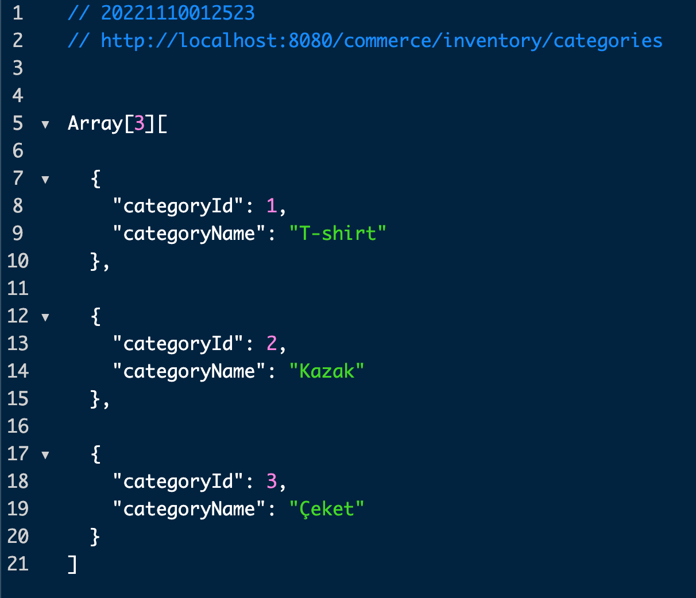
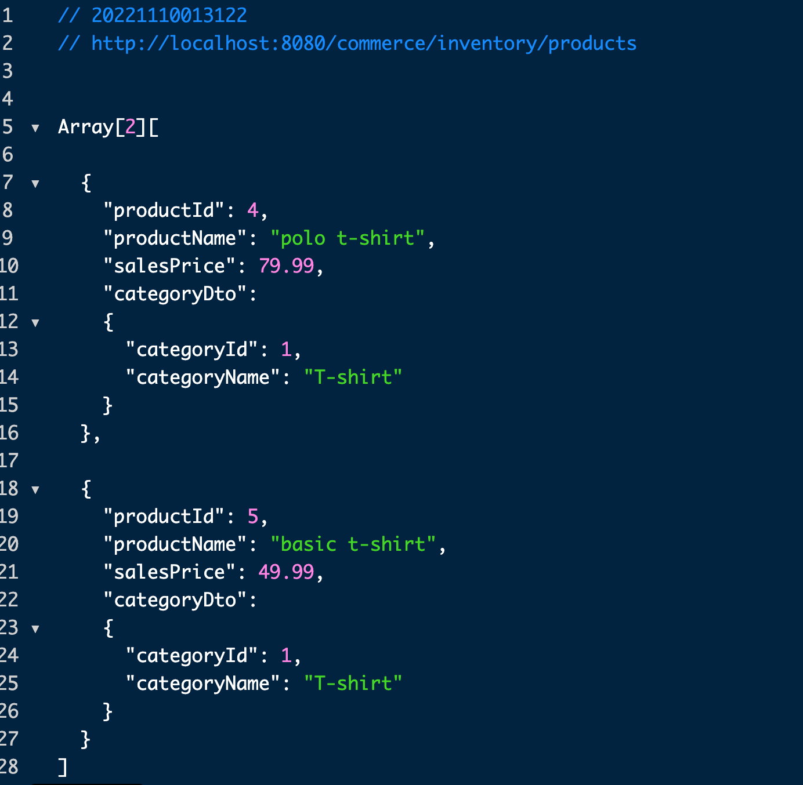
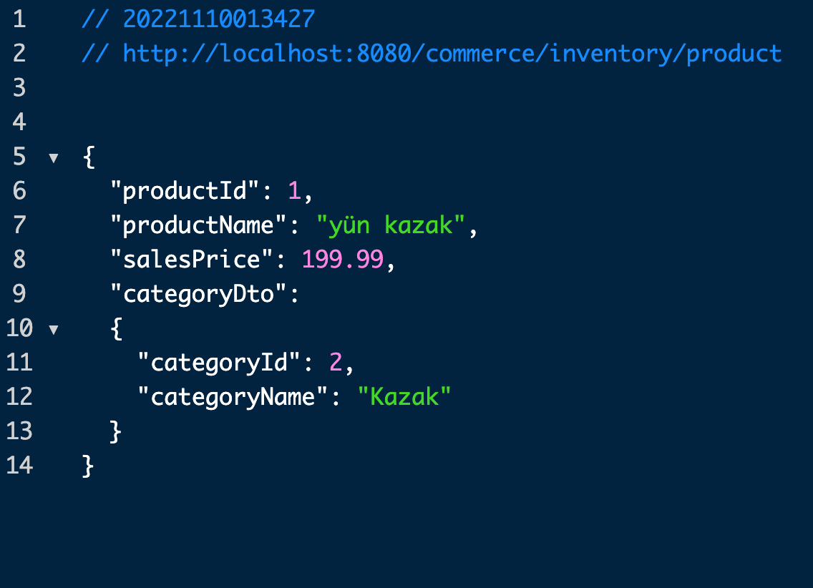
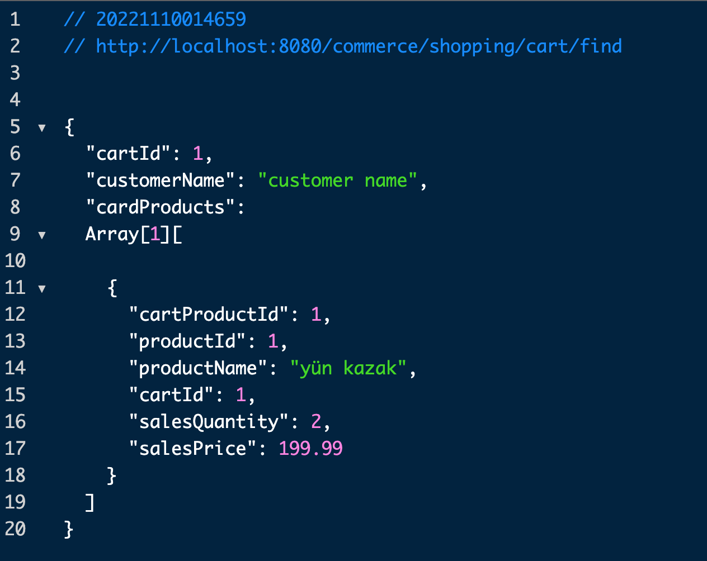

## Commerce Api Endpointleri ve Client Testleri

### Kategori listesi

* ### Api Endpoint 

    http://localhost:8080/api/commerce/inventory/categories

    @GetMapping("/categories")
    public ResponseEntity<?> getCategoryList(){
        String url = BASE_URL+"categories";
        HttpEntity<String> entity = new HttpEntity<>("Gövde");
        ResponseEntity<Object> responseEntity = restTemplate.exchange(url, HttpMethod.GET,entity,Object.class);
        return  ResponseEntity.status(responseEntity.getStatusCode()).body(responseEntity.getBody());
    }

* ### Client 

    http://localhost:8080/commerce/inventory/categories

    @GetMapping("/categories")
    public ResponseEntity<?> getCategoryList(){
        String url = BASE_URL+"categories";
        HttpEntity<String> entity = new HttpEntity<>("Gövde");
        ResponseEntity<Object> responseEntity = restTemplate.exchange(url, HttpMethod.GET,entity,Object.class);
        return  ResponseEntity.status(responseEntity.getStatusCode()).body(responseEntity.getBody());
    }
 
* ### Response

    

  

### Kategoriye Göre Ürün Listesi

* ### Api Endpoint

    http://localhost:8080/api/inventory/products/{categoryId}

    @GetMapping("/products/{categoryId}")
    public Object getProductsByCategory(@PathVariable("categoryId")long categoryId){
        String url = BASE_URL+"products/"+categoryId;
        HttpEntity<String> entity = new HttpEntity<>("Gövde");
        ResponseEntity<Object> responseEntity = restTemplate.exchange(url, HttpMethod.GET,entity,Object.class);
        return ResponseEntity.status(responseEntity.getStatusCode()).body(responseEntity.getBody());
    }

* ### Client

    http://localhost:8080/commerce/inventory/products

    @GetMapping("/products")
    public Object getProductsByCategory(){
        long categoryId=1;
        String url = BASE_URL+"products/"+categoryId;
        HttpEntity<String> entity = new HttpEntity<>("Gövde");
        ResponseEntity<Object> responseEntity = restTemplate.exchange(url, HttpMethod.GET,entity,Object.class);
        return ResponseEntity.status(responseEntity.getStatusCode()).body(responseEntity.getBody());
    }

* ### Response

  

### Id'ye göre ürün detayı

* ### Api Endpoint

    http://localhost:8080/api/inventory/product/{id}

    @GetMapping("/product/{id}")
    public Object getProduct(@PathVariable("id")long id){
        String url = BASE_URL+"product/"+id;
        HttpEntity<String> entity = new HttpEntity<>("Gövde");
        ResponseEntity<Object> responseEntity = restTemplate.exchange(url, HttpMethod.GET,entity,Object.class);
        return ResponseEntity.status(responseEntity.getStatusCode()).body(responseEntity.getBody());
    }

* ### Client

    http://localhost:8080/commerce/inventory/product

    @GetMapping("/product")
    public Object getProduct(){
        long productId=1;
        String url = BASE_URL+"product/"+productId;
        HttpEntity<String> entity = new HttpEntity<>("Gövde");
        ResponseEntity<Object> responseEntity = restTemplate.exchange(url, HttpMethod.GET,entity,Object.class);
        return ResponseEntity.status(responseEntity.getStatusCode()).body(responseEntity.getBody());
    }

* ### Response

  

### Cart oluşturma

* ### Api Endpoint

    http://localhost:8080/api/commerce/shopping/cart/create

    @GetMapping("/cart/create")
    public ResponseEntity<?> getCartId(@RequestHeader(value = "customerName",defaultValue = "")String customerName) {
        String url = BASE_URL+"cart/create";
        HttpHeaders headers = new HttpHeaders();
        headers.add("customerName",customerName);
        HttpEntity<String> entity = new HttpEntity<>("Gövde",headers);
        ResponseEntity<Long> response = restTemplate.exchange(url, HttpMethod.GET, entity, Long.class);
        return ResponseEntity.ok(response.getBody());
    }

* ### Client

    http://localhost:8080/commerce/shopping/cart/create

    @GetMapping("/cart/create")
    public ResponseEntity<?> getCartId() {
        String url = BASE_URL+"cart/create";
        HttpHeaders headers = new HttpHeaders();
        headers.add("customerName","murat tanriverdi");
        HttpEntity<String> entity = new HttpEntity<>("Gövde",headers);
        ResponseEntity<Long> response = restTemplate.exchange(url, HttpMethod.GET, entity, Long.class);
        return ResponseEntity.ok(response.getBody());
    }

* ### Response

  

### Cart'a  Ürün Ekleme

* ### Api Endpoint

    http://localhost:8080/api/commerce/shopping/cart/add

    @PostMapping("/cart/add")
    public ResponseEntity<?> addCart(@RequestBody CartProductDto cartProductDto) {
        String url = BASE_URL+"cart/add";
        String message = restTemplate.postForObject(url, cartProductDto, String.class);
        return ResponseEntity.ok(message);
    }

* ### Client

    http://localhost:8080/commerce/shopping/cart/add

    @GetMapping("/cart/add")
    public ResponseEntity<?> addCart() {
        long cartId = (Long) getCartId().getBody();
        ProductDto productDto = getProductById(1);
        if(null == productDto){
            return ResponseEntity.status(HttpStatus.NOT_FOUND).body("ürün Bulunamadı!");
        }
        CartProductDto cartProductDto = new CartProductDto(0,productDto.getProductId(),productDto.getProductName(),cartId,4, productDto.getSalesPrice());
        String url = BASE_URL+"cart/add";
        String message = restTemplate.postForObject(url, cartProductDto, String.class);
        return ResponseEntity.ok(message);
    }

* ### Response

  

### Cart'tan Ürün Silme

* ### Api Endpoint

    http://localhost:8080/api/commerce/shopping/cart/{cartId}/remove/{productId}

    @DeleteMapping("/cart/{cartId}/remove/{productId}")
    public ResponseEntity<?> addCart(@PathVariable("cartId") long cartId, @PathVariable("productId") long productId) {
        String url = BASE_URL+"cart/" + cartId + "/remove/" + productId;
        restTemplate.delete(url);
        return ResponseEntity.ok("Ürün Sepetten Silindi!");
    }

* ### Client

    http://localhost:8080/commerce/shopping/cart/remove

    @GetMapping("/cart/remove")
    public ResponseEntity<?> removeCart() {
        long cartId = (Long) getCartId().getBody();
        long productId = 1;
        String url = BASE_URL +"cart/"+ cartId + "/remove/" + productId;
        restTemplate.delete(url);
        return ResponseEntity.ok("Ürün Sepetten Silindi1!");
    }

* ### Response

  

### Checkout

* ### Api Endpoint

    http://localhost:8080/api/commerce/shopping/checkout/{cartId}

     @GetMapping("/checkout/{cartId}")
    public ResponseEntity<?> checkout(@PathVariable("cartId") long cartId) {
        String url = BASE_URL+"checkout/" + cartId;
        HttpEntity<String> entity = new HttpEntity<>("Gövde");
        ResponseEntity<String> responseEntity = restTemplate.exchange(url,HttpMethod.GET,entity,String.class);
        return ResponseEntity.status(responseEntity.getStatusCode()).body(responseEntity.getBody());
    }

* ### Client

    http://localhost:8080/commerce/shopping/checkout/

    @GetMapping("/checkout")
    public ResponseEntity<?> checkout() {
        long cartId =1;
        String url = BASE_URL+"checkout/" + cartId;
        HttpEntity<String> entity = new HttpEntity<>("Gövde");
        ResponseEntity<String> responseEntity = restTemplate.exchange(url,HttpMethod.GET,entity,String.class);
        return ResponseEntity.status(responseEntity.getStatusCode()).body(responseEntity.getBody());
    }

* ### Response

  

### Cart Detayı Görüntüleme

* ### Api Endpoint

    http://localhost:8080/api/commerce/shopping/cart/find/{cartId}

    @GetMapping("/cart/find/{cartId}")
    public ResponseEntity<?> findCartById(@PathVariable("cartId") long cartId) {
        String url = BASE_URL+"cart/find/" + cartId;
        HttpEntity<String> entity = new HttpEntity<>("Gövde");
        ResponseEntity<Object> responseEntity = restTemplate.exchange(url,HttpMethod.GET,entity,Object.class);
        return ResponseEntity.status(responseEntity.getStatusCode()).body(responseEntity.getBody());
    }

* ### Client

    http://localhost:8080/commerce/shopping/cart/find

     @GetMapping("/cart/find")
    public ResponseEntity<?> findCartById() {
        long cartId=1;
        String url = BASE_URL+"cart/find/" + cartId;
        HttpEntity<String> entity = new HttpEntity<>("Gövde");
        ResponseEntity<CartDto> responseEntity = restTemplate.exchange(url,HttpMethod.GET,entity, CartDto.class);

        CartDto cartDto = responseEntity.getBody();

        // TODO: Revize edilebilir yapıya uymak için bu şekilde istek atıp ürün adını aldım.
        if(null != cartDto){
            cartDto.getCardProducts().forEach(cartProductDto -> {
                ProductDto productDto = getProductById(cartProductDto.getProductId());
                cartProductDto.setProductName(productDto.getProductName());
            });
        }

        return ResponseEntity.status(responseEntity.getStatusCode()).body(responseEntity.getBody());
    }

* ### Response

